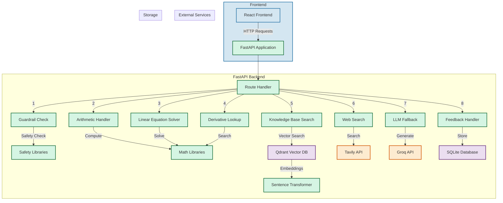

# Math Routing Agent - Architecture

## Component Description

1. **Frontend**
   - React-based user interface
   - Makes HTTP requests to the backend API
   - Handles user interactions and displays results

2. **Backend**
   - FastAPI application handling all requests
   - Multiple specialized handlers for different types of math problems
   - Processing pipeline with priority order:
     1. Safety checks (Guardrails)
     2. Direct arithmetic computation
     3. Linear equation solving
     4. Derivative lookup
     5. Knowledge base search
     6. Web search
     7. LLM-based fallback

3. **External Services**
   - Groq API for LLM capabilities
   - Tavily API for web search

4. **Storage**
   - SQLite database for feedback storage
   - Qdrant vector database for knowledge base
   - Sentence Transformer for text embeddings

## Request Flow

1. User submits a math question through the React frontend
2. FastAPI backend receives the request
3. Question goes through the processing pipeline:
   - First, safety checks ensure the input is appropriate
   - Then, specialized handlers attempt to solve the problem
   - If no direct solution is found, knowledge base is searched
   - Web search and LLM fallback as last resort
4. Response is sent back to frontend
5. User can provide feedback, which is stored in SQLite database
6. Feedback can be used to improve knowledge base

## Technologies Used

- Frontend: React, JavaScript
- Backend: FastAPI, Python 3.13
- Databases: SQLite, Qdrant
- ML/AI: Sentence Transformers, Groq LLM
- External APIs: Tavily, Groq
- Math Libraries: Custom Python implementations